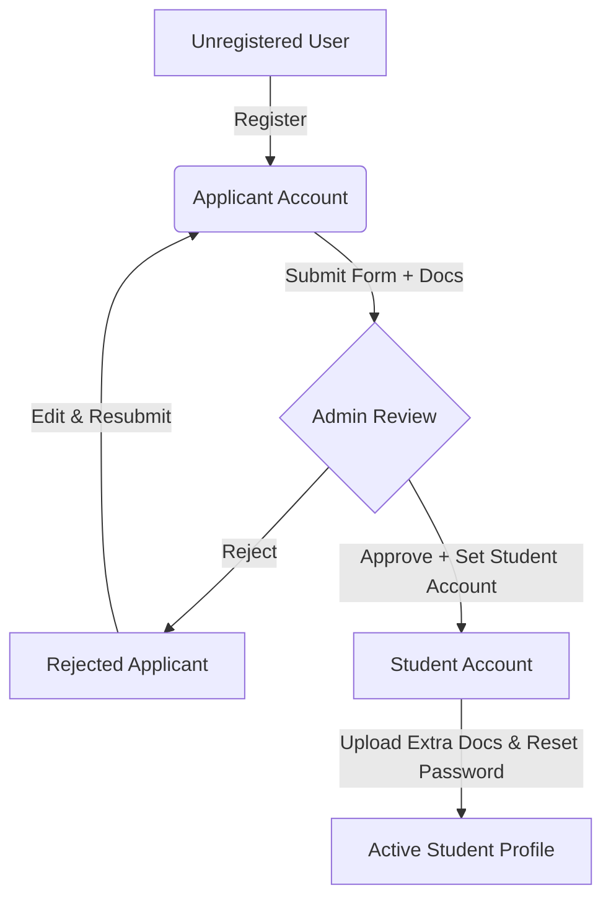

# Admission Management System - Project Explanation

This document provides a comprehensive overview of the **Admission Management System** for **Mahamaya Polytechnic of Information Technology, Siddharthnagar**. It details the technology stack, application architecture, workflows, database schemas, and security measures.

---

## 🛠️ Technology Stack

The project is built as a complete full-stack web application with a decoupled frontend and backend:

### Frontend
*   **Framework**: React (v19) initialized with Vite for rapid bundling.
*   **Routing**: React Router DOM (v7) managing dynamic path resolution and role-based protected routes.
*   **State Management**: Context API (`AuthContext` and `ThemeContext`) for session management, login states, and dark/light mode toggles.
*   **Icons**: Lucide React.
*   **Styling**: Vanilla CSS with modern tokens, custom parameters, glassmorphism, responsive grids, and dark/light variants (using `data-theme` selectors).

### Backend
*   **Runtime Environment**: Node.js.
*   **API Framework**: Express.js.
*   **Database Integration**: MongoDB via Mongoose ORM.
*   **Authentication**: JSON Web Token (JWT) combined with `bcryptjs` password hashing.
*   **File Upload Handling**: Multer middleware, limiting file sizes to 50MB and handling single/multiple file uploads.
*   **Email Notification**: Nodemailer, supporting dual modes: SMTP Relay (Brevo SMTP) and direct Brevo API.
*   **Export Engine**: SheetJS (XLSX library) for writing structured Excel spreadsheets on-the-fly.

---

## 📂 Project Structure

```
Project/
├── backend/
│   ├── middleware/        # Authorization verification (JWT) & file upload limits (Multer)
│   ├── models/            # Mongoose Schemas (User & Application models)
│   ├── routes/            # Express controllers (auth, applications, students, export)
│   ├── uploads/           # Physical directory storing uploaded applicant/student assets
│   ├── utils/             # Transporter systems (e.g., Brevo API & Nodemailer SMTP helper)
│   ├── server.js          # Main entrypoint, handles DB connection and seeding default users
│   └── .env               # Environment configuration files (Mongo URI, Port, Mail API keys)
└── frontend/
    ├── src/
    │   ├── assets/        # Graphics, icons, and official logos
    │   ├── components/    # Reusable layouts (e.g., CollegeHeader containing the Theme Switcher)
    │   ├── context/       # AuthContext (JWT verification/login/register) and ThemeContext
    │   ├── pages/         # High-level views (Login, Register, Admin, Applicant, Student dashboards)
    │   ├── App.jsx        # Routing declaration and authorization check bindings
    │   └── index.css      # Design system configurations (light/dark colors, layout definitions)
```

---

## 🔄 Core Workflows

The portal handles three discrete user roles, each featuring custom dashboards and actions:



### 1. Applicant Workflow
*   **Registration**: A visitor creates an applicant account with a username, email, and password.
*   **Application Submission**:
    *   Applicants log in and fill out the admission form, including personal details, academic metrics (JEECUP Application Number), and selected branch.
    *   They upload key scanned credentials: **Photo, 10th Marksheet, Income Certificate, and Domicile Certificate** (with optional 12th Marksheet and Caste Certificate).
    *   Once submitted, an automated confirmation email is sent containing their applicant credentials and submission summary.
*   **Tracking Status**: Applicants can check their status. If rejected, they see the rejection reason, edit the existing fields or files, and resubmit immediately.

### 2. Admin / Teacher Workflow
*   **Dashboard Analytics**: Admins can view cards detailing total registrations, pending reviews, approvals, and rejections.
*   **Reviewing Profiles**: Admins can view candidate credentials and open uploaded document files directly in the browser.
*   **Decision System**:
    *   **Approval**: Admin fills out a unique student username and temporary password. The system checks database uniqueness, hashes the password, spawns a new `User` record with the `student` role, links it to the applicant's record, and emails the credentials to the student.
    *   **Rejection**: Admin submits a rejection reason. The system updates the application status to `rejected`, wipes any previously associated student profiles, and sends an automated notification explaining the rejection.
*   **Data Editing & Deletion**: Admins can update students' details or delete the applicant profile completely (cascading deletes of the application, applicant, and student user accounts).
*   **Export**: Admins can download a `.xlsx` spreadsheet of students approved in any specific month (formatted dynamically with custom column sizes).

### 3. Student Workflow
*   **Student Login**: Log in via the generated credentials emailed to them.
*   **Profile Inspection**: View verified admission data, branch, and documents.
*   **Profile Updates**: Change profile details (phone number, address, and profile photo) dynamically.
*   **Document Vault**:
    *   Upload remaining documents (such as the 12th marksheet or Caste Certificate) if they weren't submitted during admission.
    *   Upload extra academic assets (such as fee receipts, diplomas, character certificates) into a dedicated files list.
*   **Account Safety**: Change account passwords via custom forms requiring current password checks and strict complexity rules.

---

## 🔒 Security & Validations

1.  **JWT Verification**: API routes are protected behind token checking middlewares ensuring users can only read or write to their own resource files (unless they are an admin).
2.  **Inputs & Duplicate Check**: Inputs are verified regex-wise (e.g., phone numbers must adhere to `+91xxxxxxxxxx`). The system prevents submitting duplicate phone numbers or duplicate JEECUP Application numbers across the database.
3.  **Password Strength**: Changing or establishing student accounts requires passwords to be between 8 and 16 characters and contain at least one letter, one number, and one special symbol.
4.  **File Size Caps**: Multer checks upload payloads. Files exceeding 50MB are automatically intercepted and return a 400 Bad Request to avoid memory exhaust attacks.
